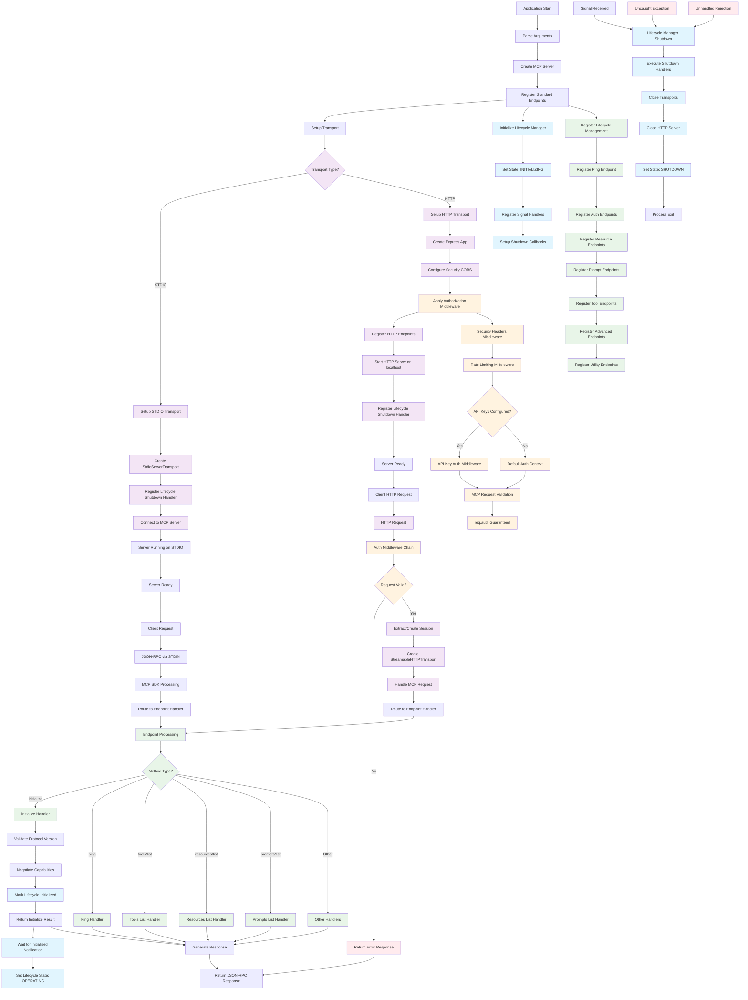
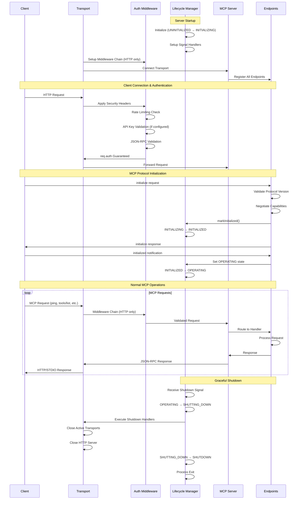
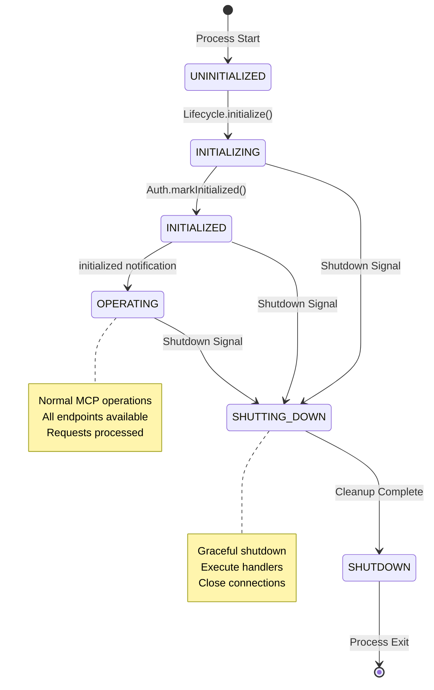

# MCP Server Architecture Flow

## Complete System Flow Diagram

```mermaid
flowchart TD
    %% Application Startup
    A[Application Start] --> B[Parse Arguments]
    B --> C[Create MCP Server]
    C --> D[Register Standard Endpoints]
    D --> E[Setup Transport]
    
    %% Lifecycle Management
    D --> LC1[Initialize Lifecycle Manager]
    LC1 --> LC2[Set State: INITIALIZING]
    LC2 --> LC3[Register Signal Handlers]
    LC3 --> LC4[Setup Shutdown Callbacks]
    
    %% Endpoint Registration Flow
    D --> EP1[Register Lifecycle Management]
    EP1 --> EP2[Register Ping Endpoint]
    EP2 --> EP3[Register Auth Endpoints]
    EP3 --> EP4[Register Resource Endpoints]
    EP4 --> EP5[Register Prompt Endpoints]
    EP5 --> EP6[Register Tool Endpoints]
    EP6 --> EP7[Register Advanced Endpoints]
    EP7 --> EP8[Register Utility Endpoints]
    
    %% Transport Setup Decision
    E --> T1{Transport Type?}
    T1 -->|STDIO| T2[Setup STDIO Transport]
    T1 -->|HTTP| T3[Setup HTTP Transport]
    
    %% STDIO Transport Flow
    T2 --> TS1[Create StdioServerTransport]
    TS1 --> TS2[Register Lifecycle Shutdown Handler]
    TS2 --> TS3[Connect to MCP Server]
    TS3 --> TS4[Server Running on STDIO]
    TS4 --> READY1[Server Ready]
    
    %% HTTP Transport Flow
    T3 --> TH1[Create Express App]
    TH1 --> TH2[Configure Security CORS]
    TH2 --> TH3[Apply Authorization Middleware]
    TH3 --> TH4[Register HTTP Endpoints]
    TH4 --> TH5[Start HTTP Server on localhost]
    TH5 --> TH6[Register Lifecycle Shutdown Handler]
    TH6 --> READY2[Server Ready]
    
    %% Authorization Middleware Chain
    TH3 --> AM1[Security Headers Middleware]
    AM1 --> AM2[Rate Limiting Middleware]
    AM2 --> AM3{API Keys Configured?}
    AM3 -->|Yes| AM4[API Key Auth Middleware]
    AM3 -->|No| AM5[Default Auth Context]
    AM4 --> AM6[MCP Request Validation]
    AM5 --> AM6
    AM6 --> AM7[req.auth Guaranteed]
    
    %% Client Request Flow
    READY1 --> REQ1[Client Request]
    READY2 --> REQ2[Client HTTP Request]
    
    %% STDIO Request Processing
    REQ1 --> SR1[JSON-RPC via STDIN]
    SR1 --> SR2[MCP SDK Processing]
    SR2 --> SR3[Route to Endpoint Handler]
    
    %% HTTP Request Processing  
    REQ2 --> HR1[HTTP Request]
    HR1 --> HR2[Auth Middleware Chain]
    HR2 --> HR3{Request Valid?}
    HR3 -->|No| HR4[Return Error Response]
    HR3 -->|Yes| HR5[Extract/Create Session]
    HR5 --> HR6[Create StreamableHTTPTransport]
    HR6 --> HR7[Handle MCP Request]
    HR7 --> HR8[Route to Endpoint Handler]
    
    %% Endpoint Processing
    SR3 --> PROC[Endpoint Processing]
    HR8 --> PROC
    
    %% MCP Protocol Flow
    PROC --> MP1{Method Type?}
    MP1 -->|initialize| MP2[Initialize Handler]
    MP1 -->|ping| MP3[Ping Handler]
    MP1 -->|tools/list| MP4[Tools List Handler]
    MP1 -->|resources/list| MP5[Resources List Handler]
    MP1 -->|prompts/list| MP6[Prompts List Handler]
    MP1 -->|Other| MP7[Other Handlers]
    
    %% Initialize Flow
    MP2 --> INIT1[Validate Protocol Version]
    INIT1 --> INIT2[Negotiate Capabilities]
    INIT2 --> INIT3[Mark Lifecycle Initialized]
    INIT3 --> INIT4[Return Initialize Result]
    INIT4 --> INIT5[Wait for Initialized Notification]
    INIT5 --> INIT6[Set Lifecycle State: OPERATING]
    
    %% Response Flow
    MP3 --> RESP[Generate Response]
    MP4 --> RESP
    MP5 --> RESP
    MP6 --> RESP
    MP7 --> RESP
    INIT4 --> RESP
    
    RESP --> RET1[Return JSON-RPC Response]
    HR4 --> RET1
    
    %% Shutdown Flow
    SIG1[Signal Received] --> SHUT1[Lifecycle Manager Shutdown]
    SHUT1 --> SHUT2[Execute Shutdown Handlers]
    SHUT2 --> SHUT3[Close Transports]
    SHUT3 --> SHUT4[Close HTTP Server]
    SHUT4 --> SHUT5[Set State: SHUTDOWN]
    SHUT5 --> EXIT[Process Exit]
    
    %% Error Handling
    ERROR1[Uncaught Exception] --> SHUT1
    ERROR2[Unhandled Rejection] --> SHUT1
    
    %% Styling
    classDef lifecycle fill:#e1f5fe
    classDef transport fill:#f3e5f5
    classDef auth fill:#fff3e0
    classDef endpoint fill:#e8f5e8
    classDef error fill:#ffebee
    
    class LC1,LC2,LC3,LC4,INIT3,INIT5,INIT6,SHUT1,SHUT2,SHUT3,SHUT4,SHUT5 lifecycle
    class T1,T2,T3,TS1,TS2,TS3,TH1,TH2,TH4,TH5,TH6,HR1,HR5,HR6,HR7 transport
    class TH3,AM1,AM2,AM3,AM4,AM5,AM6,AM7,HR2,HR3 auth
    class EP1,EP2,EP3,EP4,EP5,EP6,EP7,EP8,MP1,MP2,MP3,MP4,MP5,MP6,MP7,PROC endpoint
    class ERROR1,ERROR2,HR4 error
```

## Detailed Component Interactions

```mermaid
sequenceDiagram
    participant Client
    participant Transport
    participant AuthMW as Auth Middleware
    participant LifecycleMgr as Lifecycle Manager
    participant MCPServer as MCP Server
    participant Endpoints
    
    %% Server Startup
    Note over LifecycleMgr: Server Startup
    LifecycleMgr->>LifecycleMgr: Initialize (UNINITIALIZED → INITIALIZING)
    LifecycleMgr->>LifecycleMgr: Setup Signal Handlers
    Transport->>AuthMW: Setup Middleware Chain (HTTP only)
    Transport->>MCPServer: Connect Transport
    MCPServer->>Endpoints: Register All Endpoints
    
    %% Client Connection (HTTP)
    Note over Client,Endpoints: Client Connection & Authentication
    Client->>Transport: HTTP Request
    Transport->>AuthMW: Apply Security Headers
    AuthMW->>AuthMW: Rate Limiting Check
    AuthMW->>AuthMW: API Key Validation (if configured)
    AuthMW->>AuthMW: JSON-RPC Validation
    AuthMW->>Transport: req.auth Guaranteed
    Transport->>MCPServer: Forward Request
    
    %% MCP Initialize Protocol
    Note over Client,Endpoints: MCP Protocol Initialization
    Client->>Endpoints: initialize request
    Endpoints->>Endpoints: Validate Protocol Version
    Endpoints->>Endpoints: Negotiate Capabilities
    Endpoints->>LifecycleMgr: markInitialized()
    LifecycleMgr->>LifecycleMgr: INITIALIZING → INITIALIZED
    Endpoints->>Client: initialize response
    Client->>Endpoints: initialized notification
    Endpoints->>LifecycleMgr: Set OPERATING state
    LifecycleMgr->>LifecycleMgr: INITIALIZED → OPERATING
    
    %% Normal Operations
    Note over Client,Endpoints: Normal MCP Operations
    loop MCP Requests
        Client->>Transport: MCP Request (ping, tools/list, etc.)
        Transport->>AuthMW: Middleware Chain (HTTP only)
        AuthMW->>MCPServer: Validated Request
        MCPServer->>Endpoints: Route to Handler
        Endpoints->>Endpoints: Process Request
        Endpoints->>MCPServer: Response
        MCPServer->>Transport: JSON-RPC Response
        Transport->>Client: HTTP/STDIO Response
    end
    
    %% Graceful Shutdown
    Note over LifecycleMgr,Endpoints: Graceful Shutdown
    LifecycleMgr->>LifecycleMgr: Receive Shutdown Signal
    LifecycleMgr->>LifecycleMgr: OPERATING → SHUTTING_DOWN
    LifecycleMgr->>Transport: Execute Shutdown Handlers
    Transport->>Transport: Close Active Transports
    Transport->>Transport: Close HTTP Server
    LifecycleMgr->>LifecycleMgr: SHUTTING_DOWN → SHUTDOWN
    LifecycleMgr->>LifecycleMgr: Process Exit
```

## State Management Flow

```mermaid
stateDiagram-v2
    [*] --> UNINITIALIZED: Process Start
    
    UNINITIALIZED --> INITIALIZING: Lifecycle.initialize()
    
    INITIALIZING --> INITIALIZED: Auth.markInitialized()
    INITIALIZING --> SHUTTING_DOWN: Shutdown Signal
    
    INITIALIZED --> OPERATING: initialized notification
    INITIALIZED --> SHUTTING_DOWN: Shutdown Signal
    
    OPERATING --> SHUTTING_DOWN: Shutdown Signal
    
    SHUTTING_DOWN --> SHUTDOWN: Cleanup Complete
    
    SHUTDOWN --> [*]: Process Exit
    
    note right of OPERATING
        Normal MCP operations
        All endpoints available
        Requests processed
    end note
    
    note right of SHUTTING_DOWN
        Graceful shutdown
        Execute handlers
        Close connections
    end note
```