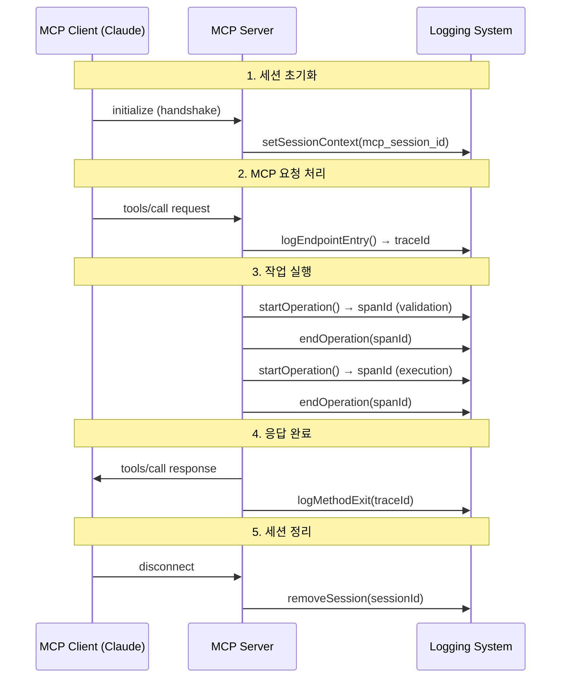

# MCP 프로토콜 기반 로깅 시스템 가이드

## 개요

MCP (Model Context Protocol) 서버의 로깅 시스템은 프로토콜 표준에 따라 사용자 세션 추적, 분산 추적, 그리고 운영 모니터링을 제공합니다. 이 문서는 MCP 프로토콜 컨텍스트에서의 로깅 라이프사이클과 식별자 체계를 명확하게 정의합니다.

## MCP 프로토콜 기반 식별자 정의

### 1. Session ID (MCP 사용자 세션 식별자)

**정의**: MCP 프로토콜에서 정의하는 사용자 세션을 식별하는 고유 식별자

**MCP 프로토콜 컨텍스트**:
- 사용자가 MCP 클라이언트(Claude, VS Code, etc.)를 통해 서버에 연결할 때 생성
- 사용자의 전체 작업 세션을 나타냄 (단순 TCP/HTTP 연결이 아님)
- 사용자 컨텍스트, 대화 히스토리, 세션 상태를 포함하는 논리적 세션

**형식**: `mcp_session_{userContext}_{timestamp}`

**예시**: `mcp_session_user_claude_1753546615332`

**생성 규칙**:
- MCP 클라이언트가 초기 handshake 시 제공하거나 서버에서 생성
- 사용자 컨텍스트 정보 포함 (클라이언트 유형, 사용자 식별자 등)
- MCP 프로토콜 초기화(`initialize` 메서드) 시점에 확정

**생명주기**:
- **생성**: MCP 프로토콜 handshake 완료 시점
- **지속**: 사용자의 전체 작업 세션 동안 (연결이 끊어져도 세션은 유지될 수 있음)
- **종료**: 사용자가 명시적으로 세션 종료하거나 장시간 비활성 상태

**용도**:
- 사용자별 요청 그룹화 및 컨텍스트 유지
- 사용자 세션별 권한 및 상태 관리
- 크로스 연결 세션 추적 (재연결 시 세션 복원)
- 사용자별 설정 및 개인화 상태 관리

```typescript
// MCP Session ID 생성 예시
function generateMcpSessionId(clientInfo: {
  type: string;
  userId?: string;
  instanceId?: string;
}): string {
  const timestamp = Date.now();
  const context = clientInfo.userId || clientInfo.type;
  return `mcp_session_${context}_${timestamp}`;
}

// 사용 예시 - MCP 초기화 시
const sessionId = generateMcpSessionId({
  type: "claude",
  userId: "user_123",
  instanceId: "inst_456"
});
logger.setSessionContext(sessionId);
// 결과: "mcp_session_user_123_1753546615332"
```

### 2. Trace ID (요청 추적 식별자)

**정의**: 단일 MCP 요청 처리 과정 전체를 추적하는 분산 추적 식별자

**MCP 프로토콜 컨텍스트**:
- MCP JSON-RPC 요청(`tools/call`, `resources/list` 등)의 시작부터 완료까지 추적
- 요청 처리 중 발생하는 모든 하위 작업을 하나의 트레이스로 그룹화
- W3C Trace Context 표준을 따라 외부 시스템과의 상호 운용성 보장

**형식**: 128비트 (32자리 16진수) - W3C 표준

**예시**: `4bf92f3577b34da6a3ce929d0e0e4736`

**생성 규칙**:
- W3C Trace Context 표준 준수
- 128비트 = 32자리 16진수 문자열 (소문자)
- OpenTelemetry 호환 형식
- MCP 요청 ID와 1:1 매핑

**생명주기**:
- **생성**: MCP JSON-RPC 요청 수신 시점 (`logEndpointEntry`)
- **지속**: 해당 MCP 요청의 모든 처리 단계 동안 유지
- **종료**: MCP 응답 반환 시점 (`logMethodExit`)

**용도**:
- MCP 요청의 전체 처리 흐름 추적
- 요청별 성능 분석 및 병목점 식별
- 오류 발생 시 전체 실행 경로 추적
- 외부 서비스 호출 시 트레이스 전파

```typescript
// MCP 요청 Trace ID 생성 및 사용 예시
const traceId = await logger.logEndpointEntry("tools/call", "mcp_req_001", params);
// MCP 요청 처리: 툴 검증, 실행, 결과 반환
await logger.logMethodExit("tools/call", result, "tools", traceId);
// 결과: "4bf92f3577b34da6a3ce929d0e0e4736"
```

### 3. Span ID (작업 단위 식별자)

**정의**: MCP 요청 처리 중 개별 작업 단위를 식별하는 식별자

**MCP 프로토콜 컨텍스트**:
- MCP 요청 처리 중 발생하는 세부 작업들을 구분 (툴 검증, 실행, 결과 생성 등)
- 각 작업의 시작과 종료를 추적하여 성능 병목점 식별
- 계층적 작업 구조를 통해 복잡한 MCP 작업 흐름 추적

**형식**: 64비트 (16자리 16진수) - W3C 표준

**예시**: `a2fb4a1d1a96d312`

**생성 규칙**:
- 64비트 = 16자리 16진수 문자열 (소문자)
- 각 작업마다 고유한 Span ID 생성
- 부모-자식 관계를 통한 계층 구조 형성
- W3C Trace Context 표준 준수

**생명주기**:
- **생성**: MCP 작업 시작 시점 (`startOperation`)
- **지속**: 해당 작업 진행 동안 유지
- **종료**: 작업 완료 시점 (`endOperation`)

**용도**:
- MCP 요청 내 개별 작업 구분 (예: 툴 검증, 툴 실행, 응답 생성)
- 작업 간 부모-자식 관계 추적 (중첩 작업 지원)
- 세부 성능 측정 및 최적화 포인트 식별
- 작업 단위 오류 추적 및 디버깅

```typescript
// MCP 작업 Span ID 생성 및 사용 예시
const validationSpanId = logger.startOperation("mcp.tool.validation", {
  toolName: "calculator",
  operation: "parameter_check"
});

// 작업 완료
logger.endOperation(validationSpanId, {
  validationResult: "success",
  parametersCount: 2,
  duration: 15
});
// 결과: "a2fb4a1d1a96d312"
```

## MCP 프로토콜 기반 식별자 관계

### 계층 구조

```
MCP Session ID (사용자 세션 레벨)
└── Connection ID (물리적 연결 레벨)
    └── Trace ID (MCP 요청 레벨)
        ├── Span ID (툴 검증 작업)
        ├── Span ID (툴 실행 작업)
        └── Span ID (응답 생성 작업)
            └── Span ID (하위 작업)
```

### MCP 컨텍스트 매핑

```typescript
interface McpTraceContext {
  // MCP 사용자 세션 (논리적 세션)
  sessionId: string;    // mcp_session_user_123_1753546615332
  
  // 물리적 연결 정보
  connectionId: string; // conn_1753546615332_hhais2xo9sp
  transportType: 'stdio' | 'http' | 'websocket';
  
  // 분산 추적 정보
  traceId: string;      // 4bf92f3577b34da6a3ce929d0e0e4736
  spanId: string;       // a2fb4a1d1a96d312
  parentSpanId?: string; // 부모 Span ID (중첩 작업 시)
  
  // MCP 프로토콜 특화 정보
  mcpRequestId: string;  // MCP JSON-RPC 요청 ID
  mcpMethod: string;     // tools/call, resources/list, etc.
}
```

### MCP 로그 표현 형식

```json
{
  "message": "MCP tool execution completed",
  "_session": {
    "sessionId": "mcp_session_user_123_1753546615332",
    "connectionId": "conn_1753546615332_hhais2xo9sp",
    "clientType": "claude",
    "transportType": "stdio"
  },
  "_trace": {
    "traceId": "4bf92f3577b34da6a3ce929d0e0e4736",
    "spanId": "a2fb4a1d1a96d312", 
    "parentSpanId": "b3cd5e2a3f4g6h12",
    "operationName": "mcp.tools/call"
  },
  "_mcp": {
    "requestId": "mcp_req_001",
    "method": "tools/call",
    "toolName": "calculator",
    "protocolVersion": "2024-11-05"
  }
}
```

## MCP 로깅 라이프사이클

### MCP 프로토콜 기반 로깅 단계



### 로깅 라이프사이클 상태

1. **세션 초기화 (Session Initialization)**
   - MCP handshake 완료 시 사용자 세션 생성
   - 클라이언트 정보 및 능력 등록
   - 세션 컨텍스트 설정

2. **요청 수신 (Request Received)**
   - MCP JSON-RPC 요청 수신
   - Trace 컨텍스트 생성
   - 요청 유효성 검증

3. **작업 실행 (Operation Execution)**
   - 세부 작업 단위로 Span 생성
   - 계층적 작업 추적
   - 성능 메트릭 수집

4. **응답 반환 (Response Sent)**
   - 결과 데이터 로깅
   - Trace 완료 처리
   - 성능 통계 업데이트

5. **세션 정리 (Session Cleanup)**
   - 비활성 세션 감지
   - 리소스 해제
   - 세션 메트릭 저장

## 실제 사용 시나리오

### 시나리오 1: MCP 도구 호출 처리

```typescript
// 1. MCP 세션 컨텍스트 설정 (초기화 시)
const sessionId = generateMcpSessionId({
  type: "claude",
  userId: "user_123"
});
logger.setSessionContext(sessionId);

// 2. MCP 요청 시작 (Trace ID 생성)
const traceId = await logger.logEndpointEntry("tools/call", "mcp_req_001", {
  toolName: "calculator",
  operation: "add"
});

// 3. MCP 작업 실행 (Span ID 생성)
const validationSpan = logger.startOperation("mcp.tool.validation");
// ... 툴 파라미터 검증 로직 ...
logger.endOperation(validationSpan, { result: "valid", parametersValid: true });

const executionSpan = logger.startOperation("mcp.tool.execution"); 
// ... 툴 실행 로직 ...
logger.endOperation(executionSpan, { result: 8, executionTime: 45 });

// 4. MCP 응답 완료
await logger.logMethodExit("tools/call", {
  requestId: "mcp_req_001",
  toolName: "calculator",
  result: { value: 8 },
  success: true
}, "tools", traceId);
```

**생성되는 식별자**:
- Session ID: `mcp_session_user_123_1753546615332` (사용자 세션 동안 유지)
- Trace ID: `4bf92f3577b34da6a3ce929d0e0e4736` (이 MCP 요청만)
- Span ID 1: `a2fb4a1d1a96d312` (툴 검증 작업)
- Span ID 2: `b3cd5e2a3f4g6h12` (툴 실행 작업)

### 시나리오 2: MCP 리소스 읽기 (중첩 작업)

```typescript
// MCP 리소스 요청
const mainTraceId = await logger.logEndpointEntry("resources/read", "mcp_req_002", {
  resourceUri: "file://document.txt",
  includeMetadata: true
});

// 상위 작업 - 리소스 처리
const processSpan = logger.startOperation("mcp.resource.processing");

  // 하위 작업 1 - 리소스 검증
  const validateSpan = logger.startOperation("mcp.resource.validation", {
    parentSpanId: processSpan,
    resourceType: "file"
  });
  logger.endOperation(validateSpan, { 
    validationResult: "success", 
    permissions: "read" 
  });

  // 하위 작업 2 - 리소스 읽기
  const readSpan = logger.startOperation("mcp.resource.read", {
    parentSpanId: processSpan,
    encoding: "utf-8"
  });
  logger.endOperation(readSpan, { 
    bytesRead: 2048, 
    contentType: "text/plain" 
  });

logger.endOperation(processSpan, { 
  totalDuration: 150, 
  operationsCompleted: 2 
});

await logger.logMethodExit("resources/read", {
  requestId: "mcp_req_002",
  resourceUri: "file://document.txt",
  contentLength: 2048,
  success: true
}, "resources", mainTraceId);
```

**MCP 계층 구조**:
```
MCP Trace: 4bf92f3577b34da6a3ce929d0e0e4736
├── Span: a2fb4a1d1a96d312 (mcp.resource.processing) 
    ├── Span: b3cd5e2a3f4g6h12 (mcp.resource.validation)
    └── Span: c4de6f3b4g5h7i34 (mcp.resource.read)
```

## MCP 디버깅 활용법

### 1. MCP 세션 기반 추적

```bash
# 특정 MCP 사용자 세션의 모든 활동 조회
grep "mcp_session_user_123" server.log | jq '.'

# MCP 세션 내 모든 요청 목록
grep "mcp_session_user_123" server.log | jq '._trace.traceId' | sort -u

# MCP 클라이언트별 활동 분석
grep "claude" server.log | jq '{session: ._session.sessionId, method: ._mcp.method, tool: ._mcp.toolName}'
```

### 2. MCP 요청 기반 분석

```bash
# 특정 MCP 요청의 전체 흐름 추적
grep "4bf92f3577b34da6" server.log | jq '{time: .timestamp, operation: ._trace.operationName, span: ._trace.spanId, mcp_method: ._mcp.method}'

# MCP 요청 성능 분석
grep "4bf92f3577b34da6" server.log | jq '{method: ._mcp.method, duration: ._trace.attributes."mcp.duration.ms", tool: ._mcp.toolName}'

# MCP 메서드별 성능 통계
grep "tools/call" server.log | jq '._trace.attributes."mcp.duration.ms"' | awk '{sum+=$1; count++} END {printf "평균: %.2fms, 총 요청: %d\n", sum/count, count}'
```

### 3. MCP 작업 단위 분석

```bash
# 특정 작업의 세부 정보
grep "a2fb4a1d1a96d312" server.log | jq '{message, mcp_operation: ._trace.operationName, attributes: ._trace.attributes}'

# MCP 작업 계층 구조 분석
grep "4bf92f3577b34da6" server.log | jq '{span: ._trace.spanId, parent: ._trace.parentSpanId, operation: ._trace.operationName, mcp_method: ._mcp.method}'

# 툴별 작업 성능 분석
grep "mcp.tool" server.log | jq '{tool: ._mcp.toolName, operation: ._trace.operationName, duration: ._trace.attributes.duration}'
```

### 4. MCP 프로토콜 특화 분석

```bash
# MCP 프로토콜 버전별 분석
grep "protocolVersion" server.log | jq '._mcp.protocolVersion' | sort | uniq -c

# 클라이언트 유형별 사용 패턴
grep "_session" server.log | jq '._session.clientType' | sort | uniq -c

# 에러가 발생한 MCP 요청 추적
grep '"success": false' server.log | jq '{mcp_method: ._mcp.method, tool: ._mcp.toolName, trace: ._trace.traceId, error: .error}'
```

## MCP 성능 및 저장 고려사항

### 메모리 사용량

| 식별자 타입 | 크기 | 수량 (동시) | 총 메모리 | MCP 컨텍스트 |
|------------|------|------------|----------|-------------|
| MCP Session ID | ~40 bytes | 50 sessions | ~2KB | 사용자 세션 (논리적) |
| Connection ID | ~30 bytes | 100 connections | ~3KB | 물리적 연결 |
| Trace ID | ~32 bytes | 500 traces | ~16KB | MCP 요청 추적 |  
| Span ID | ~16 bytes | 2000 spans | ~32KB | MCP 작업 단위 |
| **총계** | | | **~53KB** | **중간 규모 MCP 서버** |

### MCP 프로토콜 기반 정리 정책

- **MCP Session**: 사용자 명시적 종료 또는 30분 비활성 시 정리
- **Connection**: 물리적 연결 해제 시 즉시 정리 (세션은 유지)
- **Trace**: MCP 요청 완료 후 10분 후 정리
- **Span**: 부모 Trace 정리 시 함께 정리

### MCP 로그 인덱싱 권장사항

```sql
-- MCP 로그 저장소 인덱스 권장사항
CREATE INDEX idx_mcp_session_time ON logs(mcp_session_id, timestamp);
CREATE INDEX idx_mcp_trace_time ON logs(trace_id, timestamp);  
CREATE INDEX idx_mcp_span_parent ON logs(span_id, parent_span_id);
CREATE INDEX idx_mcp_method ON logs(mcp_method, timestamp);
CREATE INDEX idx_mcp_tool ON logs(mcp_tool_name, timestamp);
CREATE INDEX idx_mcp_client ON logs(client_type, timestamp);
```

## MCP 모범 사례

### ✅ MCP 권장사항

```typescript
// 1. MCP 세션 컨텍스트 일관성 유지
const sessionId = generateMcpSessionId({ type: "claude", userId: "user_123" });
logger.setSessionContext(sessionId);

// 2. MCP 요청별 트레이스 전파
const traceId = await logger.logEndpointEntry("tools/call", "mcp_req_001", {
  toolName: "calculator",
  operation: "add"
});
// ... 모든 하위 MCP 작업에서 동일한 traceId 사용
await logger.logMethodExit("tools/call", result, "tools", traceId);

// 3. MCP 특화 작업 명명 규칙
const spanId = logger.startOperation("mcp.tool.validation", {
  toolName: "calculator",
  mcpMethod: "tools/call"
});

// 4. MCP 컨텍스트 정보 포함
logger.endOperation(spanId, {
  "mcp.tool.result": "success",
  "mcp.parameters.count": 2,
  "mcp.execution.duration.ms": duration,
  "mcp.protocol.version": "2024-11-05"
});
```

### ❌ MCP에서 피해야 할 사항

```typescript
// 1. MCP 세션 컨텍스트 누락
// await logger.logEndpointEntry(...); // sessionId 설정 없이 사용

// 2. Trace ID 손실 (MCP 요청 추적 불가)
const traceId = await logger.logEndpointEntry("tools/call", "mcp_req_001");
// ... 
await logger.logMethodExit("tools/call", result, "tools"); // traceId 누락!

// 3. 모호한 작업 명명 (MCP 컨텍스트 없음)
const spanId = logger.startOperation("process"); // "mcp.tool.validation" 등 명확한 명명 필요

// 4. MCP 프로토콜 정보 누락
logger.endOperation(spanId); // toolName, mcpMethod 등 컨텍스트 정보 없음

// 5. 일반적인 세션 ID 사용
logger.setSessionContext("sess_123"); // MCP 프로토콜 규칙에 맞지 않음
```

## MCP 문제 해결

### MCP 로깅 시스템 일반적인 문제들

1. **MCP Session ID 중복**
   - 원인: 동일한 사용자가 동시에 여러 클라이언트 연결
   - 해결: 클라이언트 인스턴스 ID 포함하여 고유성 보장
   ```typescript
   const sessionId = generateMcpSessionId({
     type: "claude",
     userId: "user_123",
     instanceId: crypto.randomUUID()
   });
   ```

2. **Trace ID가 null (테스트 환경)**
   - 원인: OpenTelemetry가 비활성화됨
   - 해결: 테스트 환경에서는 정상 동작, 로깅 시스템이 null 처리

3. **MCP 요청 추적 불가**
   - 원인: traceId 전파 누락 또는 잘못된 MCP 메서드 명명
   - 해결: MCP 엔드포인트별 일관된 traceId 사용
   ```typescript
   const traceId = await logger.logEndpointEntry("tools/call", mcpRequestId, params);
   // 모든 하위 작업에서 동일한 traceId 사용
   await logger.logMethodExit("tools/call", result, "tools", traceId);
   ```

4. **MCP Span 계층 구조 깨짐**
   - 원인: 중첩 MCP 작업에서 parentSpanId 전달 누락
   - 해결: MCP 작업 계층에 맞는 명시적 parent 관계 설정
   ```typescript
   const validationSpan = logger.startOperation("mcp.tool.validation");
   const executionSpan = logger.startOperation("mcp.tool.execution", {
     parentSpanId: validationSpan
   });
   ```

5. **MCP 클라이언트별 성능 차이**
   - 원인: 클라이언트 유형별 최적화 부족
   - 해결: 클라이언트별 세션 관리 및 성능 모니터링

### MCP 테스트 환경 고려사항

MCP 서버 테스트 시에는 다음 사항들을 고려해야 합니다:

```typescript
// MCP 테스트 환경 대응 예시
describe("MCP Logging System", () => {
  test("MCP request flow with trace tracking", async () => {
    // 1. MCP 세션 설정
    const sessionId = generateMcpSessionId({ type: "test_client", userId: "test_user" });
    logger.setSessionContext(sessionId);
    
    // 2. MCP 요청 처리 (traceId가 null일 수 있음)
    const traceId = await logger.logEndpointEntry("tools/call", "test_req_001", {
      toolName: "test_tool"
    });
    
    // 3. 로깅 시스템은 traceId가 null이어도 정상 작동
    await logger.logMethodExit("tools/call", { success: true }, "tools", traceId);
    
    // 4. 테스트 검증: 로깅이 성공적으로 완료됨
    expect(true).toBe(true);
  });
});
```

### MCP 프로토콜 준수 검증

```typescript
// MCP 로깅 시스템 검증 유틸리티
function validateMcpLogging(logEntry: any): boolean {
  return (
    logEntry._session?.sessionId?.startsWith("mcp_session_") &&
    logEntry._mcp?.method && 
    logEntry._mcp?.protocolVersion &&
    logEntry._trace?.traceId
  );
}
```

이 가이드를 통해 MCP 프로토콜에 따른 로깅 시스템을 완전히 이해하고 효과적으로 활용할 수 있습니다. MCP 프로토콜의 사용자 세션 컨텍스트를 정확히 반영하여 분산 추적과 성능 모니터링을 구현할 수 있습니다.