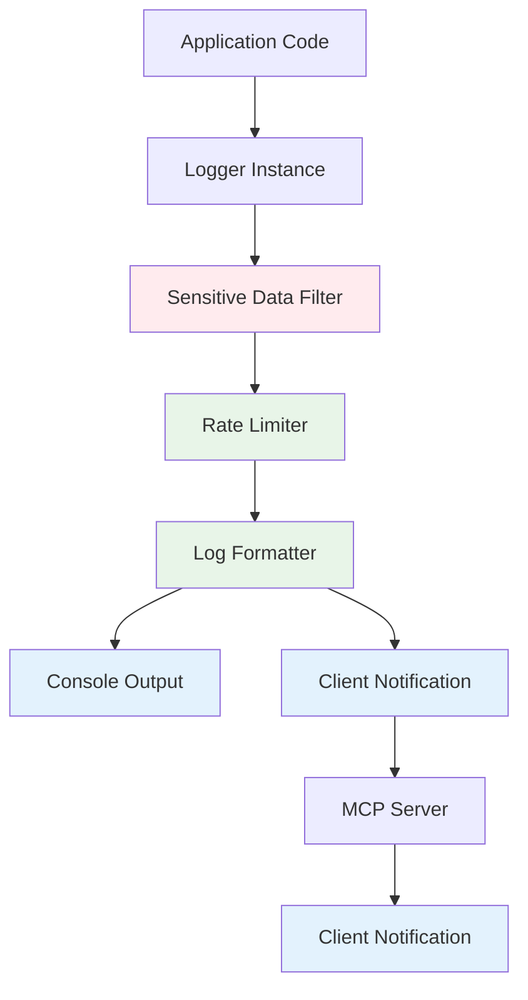

# MCP Server Logging System Documentation

## Overview

The MCP Server implements a comprehensive, production-ready logging system that follows RFC 5424 syslog severity levels and provides advanced features including rate limiting, sensitive data filtering, and client notification support.

## Features

### ✅ **RFC 5424 Compliance**
- **8 Severity Levels**: debug, info, notice, warning, error, critical, alert, emergency
- **Structured Logging**: JSON-formatted log entries with metadata
- **Level-based Filtering**: Configurable minimum log level

### 🔒 **Security Features**
- **Sensitive Data Filtering**: Automatic detection and filtering of sensitive information
- **Rate Limiting**: Prevents log flooding and resource exhaustion
- **Client Notifications**: Secure transmission of logs to MCP clients

### 🚀 **Performance Features**
- **Async Logging**: Non-blocking log operations
- **Memory Management**: Automatic cleanup of rate limiting data
- **Batched Operations**: Efficient handling of high-volume logging

## Architecture



## Logging Levels

| Level | Severity | Usage | Example |
|-------|----------|-------|---------|
| `debug` | 0 | Development debugging | Method entry/exit, detailed flow |
| `info` | 1 | General information | Server start, endpoint registration |
| `notice` | 2 | Normal but significant | Configuration changes, client connections |
| `warning` | 3 | Warning conditions | Invalid inputs, fallback scenarios |
| `error` | 4 | Error conditions | Request failures, validation errors |
| `critical` | 5 | Critical conditions | System failures, data corruption |
| `alert` | 6 | Action required | Resource exhaustion, security events |
| `emergency` | 7 | System unusable | Complete system failure |

## Core Logger Methods

### Basic Logging
```typescript
import { logger } from "./standard/logger.js";

// Basic logging by level
await logger.debug("Debug information");
await logger.info("General information");
await logger.warning("Warning message");
await logger.error("Error occurred");
await logger.critical("Critical failure");

// Structured logging
await logger.info({
  message: "User action completed",
  userId: "123",
  action: "login",
  timestamp: new Date().toISOString(),
});
```

### Specialized Methods
```typescript
// Method entry/exit tracking
await logger.logMethodEntry("functionName", { param1: "value" }, "module");
await logger.logMethodExit("functionName", { result: "success" }, "module");

// Endpoint logging
await logger.logEndpointEntry("tools/list", requestId, { cursor: "abc" });

// Error logging with auto-detection
await logger.logServerError(error, "operation context", { additionalData: "value" });
```

## Rate Limiting

### Configuration
```typescript
// Default settings
const RATE_LIMIT_WINDOW = 1000; // 1 second
const MAX_LOGS_PER_WINDOW = 10;  // 10 logs per second

// Enable/disable rate limiting
logger.setRateLimiting(true);
```

### Behavior
- **Per-Logger Rate Limits**: Each logger/level combination has separate limits
- **Critical Level Exemption**: Critical, alert, and emergency logs bypass rate limiting
- **Suppression Reporting**: Logs count of suppressed messages when window resets
- **Automatic Cleanup**: Expired rate limit entries are automatically removed

### Example
```typescript
// These will be rate limited after 10 calls in 1 second
for (let i = 0; i < 20; i++) {
  await logger.debug(`Message ${i}`);
}
// Messages 11-20 will be suppressed
// A warning will be logged about 10 suppressed messages
```

## Sensitive Data Filtering

### Automatic Detection
The system automatically detects and filters sensitive data patterns:

```typescript
const SENSITIVE_PATTERNS = [
  /password/i,
  /secret/i,
  /token/i,
  /key/i,
  /auth/i,
  /credential/i,
  /private/i,
];
```

### Filtering Behavior
```typescript
// Input
await logger.info({
  username: "john",
  password: "secret123",
  apiKey: "abc-def-ghi",
});

// Output (with filtering enabled)
{
  username: "john",
  password: "[FILTERED]",
  apiKey: "[FILTERED]"
}
```

### Configuration
```typescript
// Enable/disable sensitive data filtering
logger.setSensitiveDataFilter(true);  // Enable (default)
logger.setSensitiveDataFilter(false); // Disable for development
```

## MCP Client Integration

### Logging Endpoints

#### `logging/setLevel`
Set the minimum logging level for client notifications:

```json
{
  "jsonrpc": "2.0",
  "id": 1,
  "method": "logging/setLevel",
  "params": {
    "level": "warning"
  }
}
```

#### `logging/config` (Custom)
Configure additional logging features:

```json
{
  "jsonrpc": "2.0",
  "id": 2,
  "method": "logging/config",
  "params": {
    "sensitiveDataFilter": true,
    "rateLimiting": true
  }
}
```

### Client Notifications
Logs are sent to connected MCP clients via notifications:

```json
{
  "jsonrpc": "2.0",
  "method": "notifications/message",
  "params": {
    "level": "info",
    "logger": "resources",
    "data": {
      "message": "Resource list requested",
      "requestId": "req-123",
      "resourceCount": 5
    }
  }
}
```

## Comprehensive Logging Coverage

### Application Lifecycle
```typescript
// Server startup
await logger.info("MCP Server starting", "main");

// Lifecycle events
await logger.info({
  message: "Server state transition",
  from: "initializing",
  to: "operational"
}, "lifecycle");

// Shutdown
await logger.alert("Shutdown signal received", "lifecycle");
```

### Request Processing
```typescript
// Endpoint entry
await logger.logEndpointEntry("tools/call", requestId, {
  toolName: "calculator",
  hasArgs: true
});

// Processing steps
await logger.debug("Validating tool arguments", "tools");
await logger.debug("Executing tool", "tools");

// Results
await logger.logMethodExit("tools/call", {
  requestId,
  toolName: "calculator",
  success: true,
  executionTime: 150
}, "tools");
```

### Error Scenarios
```typescript
// Validation errors
await logger.logServerError(
  new Error("Invalid parameters"),
  "tools/call",
  { toolName: "invalid-tool", requestId }
);

// System errors
await logger.critical({
  message: "Database connection lost",
  retryAttempts: 3,
  lastError: error.message
}, "database");
```

### Transport Operations
```typescript
// HTTP transport
await logger.info("HTTP server started on port 3000", "transport");
await logger.debug("Session created", "transport", { sessionId: "sess-123" });

// STDIO transport
await logger.info("STDIO transport connected", "transport");
```

### Authorization Events
```typescript
// Authentication
await logger.logAuthEvent(req, "api_key_validation", {
  result: "success",
  keyLength: 32
});

// Rate limiting
await logger.warning("Rate limit exceeded", "auth", {
  clientId: "client-123",
  limit: 100,
  window: "60s"
});
```

## Development vs Production

### Development Configuration
```typescript
// Enable verbose logging
logger.setLevel("debug");
logger.setSensitiveDataFilter(false); // Show all data
logger.setRateLimiting(false);        // No rate limiting
```

### Production Configuration
```typescript
// Secure production logging
logger.setLevel("info");              // Reduce noise
logger.setSensitiveDataFilter(true);  // Filter sensitive data
logger.setRateLimiting(true);         // Prevent flooding
```

## Performance Characteristics

### Memory Usage
- **Rate Limiting**: O(unique_loggers) memory usage
- **Automatic Cleanup**: Expired entries removed automatically
- **Filtering**: Minimal overhead for object traversal

### CPU Impact
- **Filtering**: ~0.1ms per structured log entry
- **Rate Limiting**: ~0.05ms per log call
- **Formatting**: ~0.1ms per console output

### I/O Performance
- **Async Operations**: Non-blocking client notifications
- **Batching**: Console outputs are immediate, client notifications are queued

## Best Practices

### 1. **Use Appropriate Levels**
```typescript
// ✅ Good
await logger.debug("Entering validation function");
await logger.info("User authenticated successfully");
await logger.warning("Deprecated API used");
await logger.error("Failed to save user data");

// ❌ Avoid
await logger.error("Debug information");  // Wrong level
await logger.info("System is crashing");  // Too low for critical issue
```

### 2. **Structured Logging**
```typescript
// ✅ Good - Structured data
await logger.info({
  message: "User action completed",
  userId: user.id,
  action: "profile_update",
  duration: Date.now() - startTime
});

// ❌ Avoid - String concatenation
await logger.info(`User ${user.id} updated profile in ${duration}ms`);
```

### 3. **Context Preservation**
```typescript
// ✅ Good - Include context
await logger.error({
  message: "Database query failed",
  query: query.substring(0, 100),
  table: "users",
  error: error.message,
  requestId: req.id
});

// ❌ Avoid - Missing context
await logger.error("Query failed");
```

### 4. **Security Awareness**
```typescript
// ✅ Good - Logs are automatically filtered
await logger.info({
  message: "Authentication attempt",
  username: "john",
  password: "secret123",  // Will be filtered
  result: "success"
});

// ✅ Good - Manual filtering for extra safety
await logger.debug({
  message: "API call",
  endpoint: "/users",
  headers: sanitizeHeaders(req.headers)
});
```

## Monitoring and Observability

### Log Analysis
```bash
# Search for errors
grep "ERROR" server.log

# Monitor authentication events
grep "auth-audit" server.log | jq '.data'

# Track performance
grep "responseTimeMs" server.log | jq '.data.responseTimeMs'
```

### Metrics Collection
```typescript
// Custom metrics logging
await logger.info({
  message: "Performance metric",
  metric: "request_duration",
  value: duration,
  endpoint: "tools/list",
  timestamp: Date.now()
}, "metrics");
```

### Health Monitoring
```typescript
// Health check logging
await logger.notice({
  message: "Health check",
  status: "healthy",
  uptime: process.uptime(),
  memoryUsage: process.memoryUsage(),
  activeConnections: connectionCount
}, "health");
```

## Troubleshooting

### Common Issues

#### 1. **Missing Logs**
```typescript
// Check log level
logger.setLevel("debug"); // Lower level to see more logs

// Check rate limiting
logger.setRateLimiting(false); // Disable to see all logs
```

#### 2. **Sensitive Data Visible**
```typescript
// Enable filtering
logger.setSensitiveDataFilter(true);

// Add custom patterns if needed
// (Requires code modification for additional patterns)
```

#### 3. **Performance Issues**
```typescript
// Reduce log volume
logger.setLevel("warning"); // Higher level = fewer logs

// Enable rate limiting
logger.setRateLimiting(true);
```

### Debug Configuration
```typescript
// Maximum verbosity for debugging
logger.setLevel("debug");
logger.setSensitiveDataFilter(false);
logger.setRateLimiting(false);

await logger.debug("Debug configuration enabled");
```

## Integration Examples

### Express Middleware Integration
```typescript
import { logger } from "./standard/logger.js";

app.use((req, res, next) => {
  logger.info({
    message: "HTTP request",
    method: req.method,
    url: req.url,
    userAgent: req.headers['user-agent']
  }, "http");
  next();
});
```

### Error Boundary Integration
```typescript
process.on('uncaughtException', async (error) => {
  await logger.emergency({
    message: "Uncaught exception",
    error: error.message,
    stack: error.stack
  }, "system");
  process.exit(1);
});
```

### Custom Logger Categories
```typescript
// Create domain-specific loggers
const authLogger = {
  info: (data: any) => logger.info(data, "auth"),
  warning: (data: any) => logger.warning(data, "auth"),
  error: (data: any) => logger.error(data, "auth"),
};

const dbLogger = {
  debug: (data: any) => logger.debug(data, "database"),
  error: (data: any) => logger.error(data, "database"),
};
```

This logging system provides comprehensive observability for the MCP server while maintaining security and performance standards suitable for production deployment.